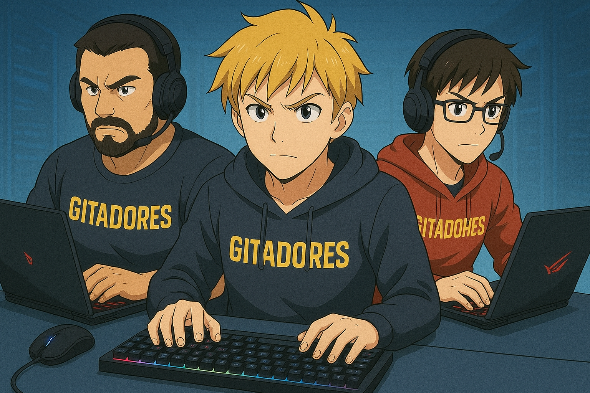
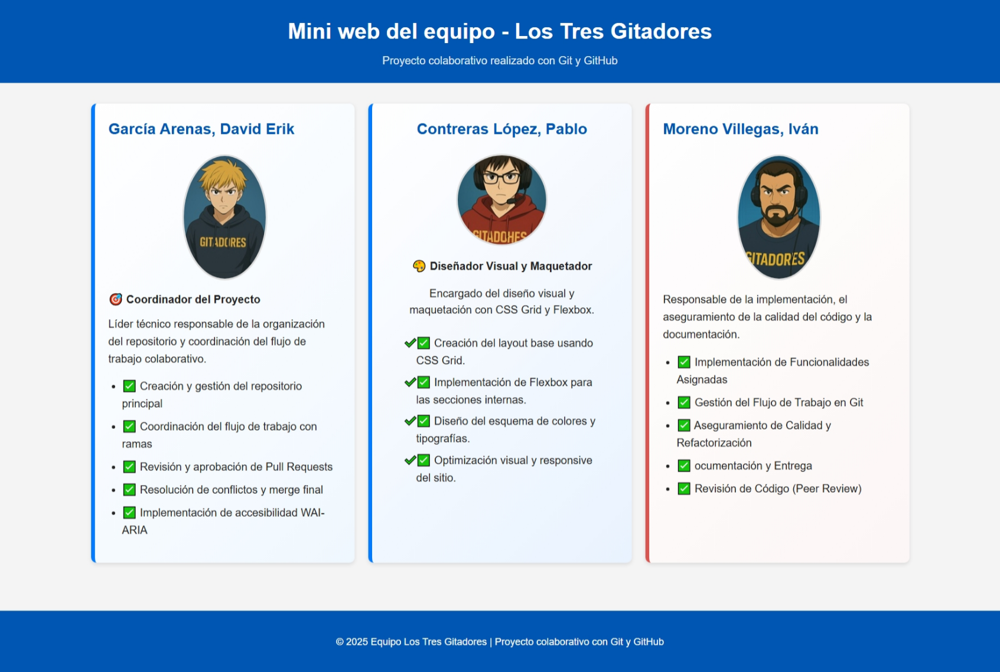

# 🌐 Mini Web del Equipo – *Los Tres Gitadores*

> Proyecto colaborativo realizado como parte de la asignatura **Sistemas de Control de Versiones (2º DAW)**.
> Desarrollado por tres estudiantes practicando flujo de trabajo profesional con Git y GitHub.

---



<p align="center">
  <b>💻 Proyecto académico · 🤝 Trabajo en equipo · 🚀 Prácticas de Git/GitHub</b>
</p>

---

## 🧭 Índice

1. [Descripción del Proyecto](#-descripción-del-proyecto)
2. [Miembros del Equipo](#-miembros-del-equipo)
3. [Tecnologías Utilizadas](#-tecnologías-utilizadas)
4. [Estructura del Proyecto](#-estructura-del-proyecto)
5. [Flujo de Trabajo Colaborativo](#-flujo-de-trabajo-colaborativo)
6. [Estado Actual del Proyecto](#-estado-actual-del-proyecto)
7. [Capturas de Pantalla](#-capturas-de-pantalla)
8. [Instalación y Uso](#-instalación-y-uso)
9. [Contribución](#-contribución)
10. [Licencia](#-licencia)
11. [Créditos](#-créditos)

---

## 📋 Descripción del Proyecto

**Mini Web del Equipo** es un sitio web colaborativo donde cada integrante añade su sección personal utilizando **ramas**, **commits**, **revisiones** y **pull requests**.
El objetivo es practicar buenas prácticas de desarrollo colaborativo y control de versiones.

---

## 👥 Miembros del Equipo

| Integrante                    | Rol                        | Responsabilidades                                                                                            |
| ----------------------------- | -------------------------- | ------------------------------------------------------------------------------------------------------------ |
| **García Arenas, David Erik** | 🎯 Coordinador             | Creación del repositorio, coordinación del flujo, revisión de PRs, resolución de conflictos y *merge* final. |
| **Contreras López, Pablo**    | 🎨 Diseño y Maquetación    | CSS Grid y Flexbox, esquema de colores y tipografía, optimización visual.                                    |
| **Moreno Villegas, Iván**     | 🧩 Documentación y Calidad | Revisión técnica, validación de estándares, documentación final.                                             |

---

## 🛠️ Tecnologías Utilizadas

* **HTML5** · Estructura semántica
* **CSS3** (Grid & Flexbox) · Diseño *responsive*
* **Git** · Control de versiones distribuido
* **GitHub** · Colaboración, revisión y automatización

---

## 📂 Estructura del Proyecto

```plaintext
miniweb-equipo-LosTresGitadores/
├── index.html        # Página principal
├── style.css         # Estilos
├── images/           # Imágenes
│   ├── erik.jpg
│   ├── pablo.jpg
│   ├── ivan.jpg
│   └── team.png      # Imagen grupal (README)
└── README.md         # Este documento
```

---

## 🚀 Flujo de Trabajo Colaborativo

### ✅ Fase 1: David (Coordinador)

1. Crea el repositorio
2. Añade estructura base + su sección personal
3. Sube a `main`

### ✅ Fase 2: Pablo

1. Clona el repositorio
2. Crea rama `seccion-pablo`
3. Añade su sección personal
4. Abre *Pull Request*
5. David revisa y aprueba

### ✅ Fase 3: Iván

1. Actualiza su repositorio local
2. Crea rama `seccion-ivan`
3. Añade su sección personal
4. Abre *Pull Request*
5. David revisa y aprueba

### ✅ Fase 4: David (Final)

1. Añade imagen grupal del equipo
2. Actualiza el README con estadísticas finales

---

## 📝 Estado Actual del Proyecto

| Fase | Descripción                         | Estado |
| ---- | ----------------------------------- | ------ |
| 1    | Estructura base + sección de David  | ✅      |
| 2    | Sección de Pablo                    | ✅      |
| 3    | Sección de Iván                     | ✅      |
| 4    | Imagen grupal y actualización final | ✅      |

---

## 🖼️ Capturas de Pantalla

> Vista general del sitio

<!-- Sube tu captura a /images y actualiza el nombre si cambia -->



---

## ⚙️ Instalación y Uso

1. Clona el repositorio:

   ```bash
   git clone https://github.com/Hawaiiiiii/miniweb-equipo-LosTresGitadores.git
   ```
2. Abre `index.html` en tu navegador.
3. Explora las secciones del equipo.

---

## 💡 Contribución

Proyecto académico. No se aceptan PRs externos.
Sugerencias: usar **Issues** o **Discussions**.

**Normas internas**

* Mensajes de commit descriptivos (*Conventional Commits* recomendado).
* Revisar y aprobar PRs antes del *merge*.
* Una rama por funcionalidad.

---

## 🧾 Licencia

Este proyecto usa licencia **MIT**. Añade el archivo `LICENSE` en la raíz si aún no existe.

---

## 🙌 Créditos

Creado por **Los Tres Gitadores**.

> “El control de versiones no solo guarda tu código, guarda tu cordura.”
> © 2025 · Prácticas de **2º DAW**.
